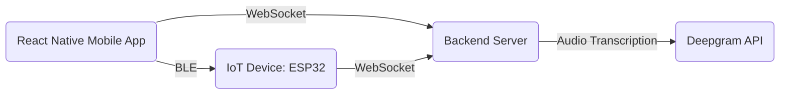
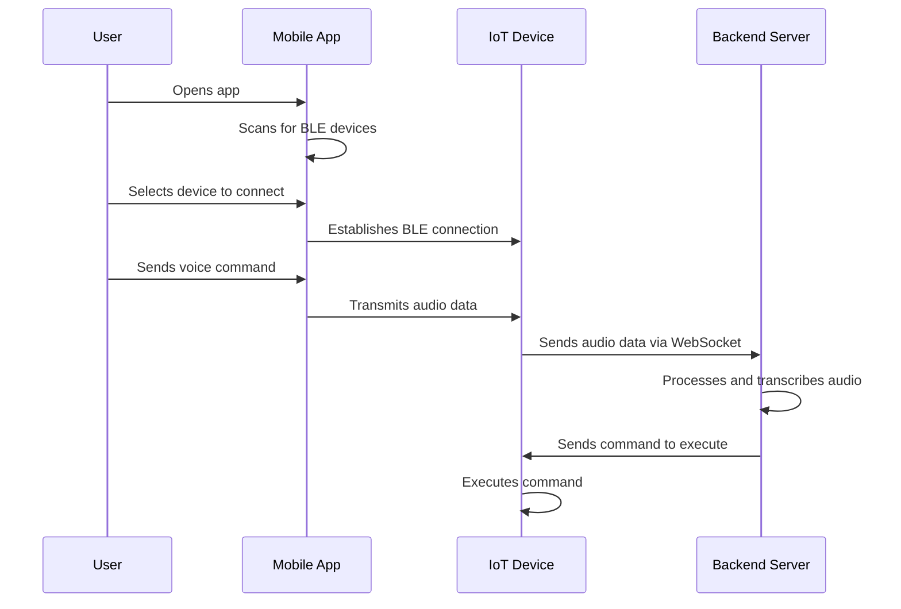

# Sparrow Assistant

## Overview

Sparrow is an open-source AI wearable platform that revolutionizes the way users interact with technology through voice. It not only transcribes and summarizes spoken content but also acts as a personal assistant, all while ensuring users retain ownership of their data. Built on the React Native framework, Sparrow facilitates cross-platform mobile app development and leverages ESP32 microcontrollers for efficient device-level interactions. This documentation delves into the core components, functionalities, and architectural design of the Sparrow platform, emphasizing its capabilities in voice and data communication via Bluetooth Low Energy (BLE) and WebSocket protocols.

## Key Features and Functionalities

- **Voice Communication**: Allows users to interact with IoT devices through voice commands.
- **Bluetooth Low Energy (BLE) Support**: Facilitates communication between the mobile app and IoT devices using BLE for efficient energy consumption.
- **WebSocket Communication**: Enables real-time data exchange between the mobile app and a backend server, enhancing user-device interaction.
- **Peripheral Device Connection Management**: Provides a user interface for scanning, connecting to, and managing BLE peripheral devices.
- **Audio Data Handling**: Supports capturing, processing, and transmitting audio data from IoT devices to the mobile app and backend server for further analysis or action.
- **Sleep Mode Management**: Includes functionality to manage sleep modes on IoT devices, optimizing power consumption.
- **Real-time Chat Interface**: Offers a chat interface for users to send and receive messages in real-time, improving user engagement.

## System Architecture



### User Interaction Flow



### Mobile Application (React Native)

- **App Entry Point (`index.js`)**: Initializes the React Native app and registers the main app component.
- **Main App Component (`App.tsx`)**: Renders the primary chat screen interface for user interaction.
- **Chat Screen (`ChatScreen.tsx`)**: Implements the chat interface, integrating functionalities such as sending messages, displaying system messages, and handling quick replies.
- **Accessory Bar (`AccessoryBar.tsx`)**: Provides additional chat functionalities, like sending images or location data (placeholders in this implementation).
- **Device Connection Modal (`DeviceConnection.tsx`)**: Manages the UI for connecting to BLE peripheral devices.
- **Device List (`DeviceList.tsx`)**: Displays available BLE devices and manages device selection.
- **Bluetooth Hooks (`useBluetooth.ts`)**: Encapsulates BLE operations, including device scanning, connection management, and data communication.

### IoT Device (ESP32)

- **WiFi Management (`WifiHandler.cpp`)**: Handles WiFi connections, including connecting to and disconnecting from WiFi networks.
- **WebSocket Management (`WebSocketHandler.cpp`)**: Manages WebSocket connections for real-time communication with the backend server.
- **Audio Handling (`AudioHandler.cpp`)**: Captures and processes audio data, determining speaking states and sending audio data over WebSocket.
- **Sleep Mode Management (`SleepHandler.cpp`)**: Controls the device's sleep mode to optimize power consumption.
- **Touch Interaction (`TouchHandler.cpp`)**: Detects touch interactions to toggle the device's sleep mode.

### Backend Server

- **WebSocket Server (`server.js`)**: Facilitates WebSocket communication, broadcasting messages to connected clients.
- **Audio Transcription (`transcribe.py`)**: Transcribes audio data to text using Deepgram's API, enabling voice command recognition and processing.

## File Structure and Organization

```
sparrow-assistant-main/
├── app/                        # Mobile application (React Native)
│   ├── babel.config.js
│   ├── index.js
│   ├── jest.config.js
│   ├── metro.config.js
│   ├── ios/
│   │   └── sparrow/
│   │       └── AppDelegate.h
│   └── src/
│       ├── App.tsx
│       ├── components/
│       │   ├── AccessoryBar.tsx
│       │   ├── CustomView.tsx
│       │   ├── DeviceConnection.tsx
│       │   ├── DeviceList.tsx
│       │   └── NavBar.tsx
│       ├── data/
│       │   ├── earlierMessages.js
│       │   └── messages.js
│       ├── hooks/
│       │   └── useBluetooth.ts
│       └── screens/
│           ├── ChatScreen.tsx
│           └── HomeScreen.tsx
├── backend/                     # Backend server
│   ├── app/
│   │   ├── __init__.py
│   │   ├── main.py
│   │   ├── server.js
│   │   ├── transcribe.py
│   │   └── ws_client.py
│   └── js/
│       └── worker.js
└── devices/                     # IoT device firmware (ESP32)
    └── esp32/
        └── src/
            ├── AudioHandler.cpp
            ├── AudioHandler.h
            ├── BLEManager.cpp
            ├── BLEManager.h
            ├── SleepHandler.cpp
            ├── SleepHandler.h
            ├── TouchHandler.cpp
            ├── TouchHandler.h
            ├── WebSocketHandler.cpp
            ├── WebSocketHandler.h
            ├── WifiHandler.cpp
            ├── WifiHandler.h
            └── main.cpp
```

## API Documentation

### Mobile App APIs

- **Bluetooth API (`useBluetooth.ts`)**: Provides functions to scan for BLE devices, connect/disconnect to/from devices, and manage device connections.
- **Chat API (`ChatScreen.tsx`)**: Handles sending and receiving chat messages, including system messages and quick replies.

### IoT Device APIs

- **WiFi API (`WifiHandler.cpp`)**: Offers methods to manage WiFi connections.
- **WebSocket API (`WebSocketHandler.cpp`)**: Provides functions to connect to the WebSocket server, send text/binary data, and handle connection events.
- **Audio API (`AudioHandler.cpp`)**: Captures and processes audio data, managing speaking states and audio transmission.
- **Sleep Mode API (`SleepHandler.cpp`)**: Controls the device's sleep mode for power optimization.

## User Interactions and Workflows

1. **Device Scanning and Connection**: Users can scan for BLE devices, view a list of available devices, and connect to a selected device.
2. **Chat Interface**: Users interact with the system through a chat interface, sending messages and receiving responses or system notifications.
3. **Voice Commands**: Users can issue voice commands to IoT devices, which are captured, processed, and potentially transcribed to text for further action.

## Integration with External Services or APIs

- **Deepgram API**: Used for transcribing audio data to text, facilitating voice command recognition and processing.

## Data Storage and Management

- **Mobile App**: Stores chat messages and device connection information locally.
- **IoT Device**: Temporarily buffers audio data and manages device state (e.g., sleep mode status).
- **Backend Server**: Handles WebSocket connections and broadcasts, potentially logging data for monitoring purposes.